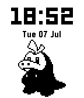

# Fuecoco Pebble Watchface

A custom Pebble watchface shaped like **Fuecoco** (the fire-crocodile Pokémon), built for a
**Pebble 2 Duo** — Core Devices' 2025 relaunch of Pebble, with a black & white e-paper screen.
Everything builds and runs through Docker, so you don't need to install the Pebble SDK on your
host machine at all.

This is a personal hobby project — it's not published to the Pebble App Store, so Pokémon
trademark concerns don't apply here.



## Hardware target

The Pebble SDK codename for this watch is **`flint`**, not `obelix` (an earlier version of this
scaffold used `obelix` by mistake — that's actually the *Pebble Time 2*, a different, pricier
watch with a 200×228 **color** screen). Verified directly against Core Devices' firmware source
(`display_qemu_flint.h` in `coredevices/PebbleOS`):

| | `flint` (Pebble 2 Duo — this repo's target) | `obelix` (Pebble Time 2) |
|---|---|---|
| Resolution | 144×168 | 200×228 |
| Color | Black & white only | 64-color |
| Price | $149 | $225 |

Because the screen is strictly 1-bit, all artwork in this project uses pure black/white pixels —
no grayscale, no color.

## Prerequisites

- **Docker**, with the daemon actually running. If you're on a snap-installed Docker (`which
  docker` → `/snap/bin/docker`), the systemd unit is `snap.docker.dockerd.service`, **not**
  `docker` — `sudo systemctl start docker` will silently do nothing on that setup. Check with
  `systemctl is-active snap.docker.dockerd.service`.
- **X11** on the host, for the emulator's GUI window (`./dev.sh emu`). On Linux this generally
  just works; `dev.sh` runs `xhost +local:` for you automatically.
- A physical Pebble 2 Duo + the Pebble mobile app, only if you want `./dev.sh install <ip>`
  (enable Developer Connection in the app's settings to get the watch's IP).

## Project structure

```
dev.sh                          # all dev commands go through this
docker-compose.yml              # single "pebble" service, mounts fuecoco-face/ into the container
Dockerfile                      # Ubuntu 24.04 + pebble-tool + Pebble SDK ("latest")
fuecoco-face/
  package.json                  # app metadata: UUID, targetPlatforms: ["flint"], resources,
                                 #   enableMultiJS/capabilities/messageKeys for weather
  wscript                       # waf build script (multi-platform loop, standard pebble-tool pattern)
  src/c/fuecoco.c                # watchface source: battery module, time, weather icon, Fuecoco
  src/pkjs/index.js              # runs on the phone: fetches weather, relays it to the watch
  resources/images/
    fuecoco.png                  # 82x98, pure black/white, extracted from reference/fuecpix.png
  reference/
    fuecpix.png                   # source cross-stitch chart the sprite is extracted from (see Credits)
  scripts/
    generate_fuecoco_art.py      # regenerates fuecoco.png from reference/fuecpix.png (via Pillow)
    create_app_icons.py          # vendored from Core Devices' watchface skill (see Credits)
    create_preview_gif.py        # vendored from Core Devices' watchface skill (see Credits)
  .devcontainer/                 # optional: open this folder directly in VS Code Dev Containers
```

## Dev workflow

One-time setup:
```bash
docker compose build
```

Everyday commands (run from the repo root):

| Command | What it does |
|---|---|
| `./dev.sh build` | Compiles the watchface → `fuecoco-face/build/*.pbw` |
| `./dev.sh emu` | Builds, installs to the `flint` QEMU emulator, opens a window on your desktop, and leaves the container running |
| `./dev.sh screenshot [file.png]` | Captures a PNG from the emulator started by `emu` (default `screenshot.png`) |
| `./dev.sh watch` | Live reload: rebuilds and reinstalls on any change under `src/` or `resources/` |
| `./dev.sh install <phone-ip>` | Builds and installs to a physical Pebble over WiFi |
| `./dev.sh icons` | Generates `icon_80x80.png`/`icon_144x144.png` from a screenshot |
| `./dev.sh gif` | Captures a rollover preview GIF from the running emulator |
| `./dev.sh shell` | Drops into a shell inside the build container |

**Seeing the watchface locally** is a two-terminal pattern: `./dev.sh emu` in one terminal (leave
it running), then `./dev.sh screenshot fuecoco.png` in a second terminal. The PNG lands in
`fuecoco-face/` on your host, via the bind mount already set up in `docker-compose.yml` — open it
in any image viewer.

## Getting it onto your actual watch

Building produces `fuecoco-face/build/<name>.pbw` — that single file *is* the installable
watchface. There are two ways to get it from there onto your Pebble 2 Duo:

### Option A — WiFi install via Developer Connection (fastest while iterating)

This is what `./dev.sh install <phone-ip>` (and `./dev.sh watch`) use. It pushes straight from
this repo to your watch over your phone's Bluetooth connection, no cables or file transfer
needed — but your computer and phone must be on the same WiFi network, and it needs to be
re-enabled each time you restart the Pebble app.

1. Open the Pebble app on your phone.
   - **Android**: tap the ⋮ overflow menu (top right) → *Settings* → enable *Developer Mode* →
     tap *Developer Connection* → toggle it on (top right).
   - **iOS**: open the side menu → *Settings* → enable *Developer Mode* → go back and tap
     *Developer* → toggle *Developer Connection* on (top right).
2. Either app then displays a **Server IP** — that's the `<phone-ip>` argument.
3. Run `./dev.sh install <phone-ip>` from this repo. It rebuilds and pushes the `.pbw` straight
   to the watch.

### Option B — Sideload the .pbw permanently (no computer needed afterward)

Better for "I just want to actually wear this," since it doesn't depend on developer mode staying
on or being near your computer. Get the `.pbw` file onto your phone (AirDrop, email yourself the
file, a cloud drive/USB — anything that lands it in your phone's normal file storage), then:

- **Android**: open it from your file manager; it should offer to open with the Pebble app,
  which installs it to the watch. If your file manager doesn't recognize the `.pbw` (common on
  newer Android versions), install [Sideload Helper by
  Rebble](https://github.com/pebble-dev/rebble-sideloader) and open the file with that instead —
  it hands it off to the Pebble app for you.
- **iOS**: use the Share Sheet on the `.pbw` (from Files, Mail, AirDrop, etc.) and choose
  *Open in Pebble* / *Copy to Pebble*, which installs it to the watch.

Either way, once installed it shows up in the watch's app/watchface list like anything from the
App Store — no ongoing WiFi/developer-mode dependency.

## Fuecoco design notes

The character art is **extracted from a real fan-made pixel/cross-stitch chart**
(`reference/fuecpix.png`, 41×49 stitches — see Credits) rather than hand-drawn from scratch, so
proportions and features (the head-flame, cream face, red back marking, tail) match the actual
character instead of an approximation. `scripts/generate_fuecoco_art.py` does the conversion:

1. Samples each stitch cell's colour from the chart (avoiding the grid lines), rebuilding a clean
   41×49 mosaic.
2. Whites out the DMC colour-key/legend panel in the chart's top-right corner — that panel is
   chart metadata, not part of the character, and must not leak into the silhouette.
3. Thresholds by luminance into pure black/white: darker threads (outline, the red back marking,
   the flame crest) become black; lighter threads (cream face/belly) become white. The 1-bit
   `flint` display can't show the original DMC colours anyway, so this keeps the two most
   important shapes — the back marking and the flame crest — bold and recognisable instead of
   losing them to a mid-tone gray.
4. Scales the result 2x with nearest-neighbour (no smoothing) to 82×98 for a crisp pixel-art look.

Time stays a plain `TextLayer` with a system font, positioned **above** the character so it never
overlaps or crowds the art.

Layout (checked so every element's bottom/right edge stays inside the 144×168 bounds):

| Element | `GRect` | Notes |
|---|---|---|
| Battery module | `GRect(1, 1, 142, 18)` | bordered box: "Battery" label (bold, left) + depletion bar (right) |
| Time | `GRect(0, 19, 144, 42)` | `FONT_KEY_LECO_42_NUMBERS`, centered |
| Weather icon | `GRect(115, 78, 21, 21)` | small, clear of Fuecoco's full `GRect` (x≥113) — see below |
| Fuecoco | `GRect(31, 68, 82, 98)` | centered horizontally, 2px margin above the bottom edge |

To change the artwork: either replace `resources/images/fuecoco.png` with your own pure
black/white PNG at 82×98 (`BitmapLayer` doesn't scale), or tweak `THRESHOLD`/`SCALE` in
`scripts/generate_fuecoco_art.py` and re-run it (`python3 scripts/generate_fuecoco_art.py` from
inside `fuecoco-face/`) to regenerate from the reference chart with different tuning.

## Weather

A small (21×21) icon shows current conditions, updated from real weather data at the phone's
GPS location — no percent/temperature text, just the icon, matching the "small and clean" style
of the battery bar.

**Data source: [Open-Meteo](https://open-meteo.com/)** — free, no API key required. There's no
public, no-auth "Google Weather" API usable for this; Open-Meteo is what the wider Pebble
developer ecosystem (including Core Devices' own official tooling, see Credits) uses for exactly
this purpose, so it's the de facto standard for Pebble weather watchfaces.

**How it flows** (the watch itself has no internet access — only the paired phone does):
```
Watch (fuecoco.c)  <-- AppMessage / Bluetooth -->  Phone (src/pkjs/index.js)  <-- HTTPS -->  Open-Meteo
```
1. `src/pkjs/index.js` runs on the phone (not the watch). On watchface launch, and every 30
   minutes after (triggered by the watch via a `REQUEST_WEATHER` message from `tick_handler`), it
   calls `navigator.geolocation.getCurrentPosition()` for the phone's GPS location, fetches
   `current=weather_code` from Open-Meteo for those coordinates, and sends the resulting WMO
   weather code to the watch as `WEATHER_CODE`.
2. The watch's `inbox_received_callback` in `fuecoco.c` receives it, maps the WMO code to one of
   five categories via `weather_code_to_condition()` (clear / cloudy / rain / snow / storm), and
   redraws the icon: sun, cloud, rain (cloud + drops), snow (cloud + dots), or storm (cloud +
   lightning bolt). Nothing is drawn until the first reading arrives.

This requires `enableMultiJS`, `"capabilities": ["location"]`, and `"messageKeys"` in
`package.json` — already set up. The **first time** the watchface runs on a real phone, the
Pebble app will prompt for location permission; without it, the icon just stays blank (no crash,
no fallback text, since we chose to keep this minimal rather than add error-state UI).

To add more conditions or change the icon shapes, edit `weather_code_to_condition()` and
`weather_icon_update_proc()` in `fuecoco.c` — the WMO code table is documented inline and at
[Open-Meteo's docs](https://open-meteo.com/en/docs) under "WMO Weather interpretation codes".

## Roadmap (not yet built)

Two variants are planned but intentionally not implemented yet:

- **Time-of-day variant** — swap Fuecoco's pose/expression or the background by hour bucket.
  Cheap to add: the existing `tick_handler` already fires every minute with the current
  `struct tm`, so bucketing on `tick_time->tm_hour` is close to free.
- **Animated variant** — an idle animation (blink, tail-flame flicker). Follow the
  "brief `app_timer_register()` bursts, never continuous per-second redraws" rule from Core
  Devices' watchface skill (see Credits) — a battery-efficiency requirement, not a style choice.
  Since the character is now a single bitmap rather than separate body/flame layers, this would
  need a small set of alternate full-frame bitmaps (or a cropped sub-region swapped independently)
  rather than reusing the current single-layer setup as-is.

## Creating a new watchface from this repo

1. Copy this whole repo to a new folder, and rename `fuecoco-face/` to `<your-name>-face/`
   (update the one-line mount path in `docker-compose.yml` to match).
2. Generate a new UUID: `python3 -c "import uuid; print(uuid.uuid4())"`.
3. Edit `package.json`: `name`, `displayName`, `uuid`, and the `resources.media` list for your
   new art files.
4. Replace `src/c/fuecoco.c` with your new watchface logic (or start from
   `templates/static-watchface.c` in Core Devices' skill repo, see Credits).
5. Replace the artwork in `resources/images/`.
6. Clear the stale build cache: `rm -rf <your-name>-face/build` (it's root-owned, from the
   Docker build — see Troubleshooting).
7. Verify with the workflow above: `./dev.sh build`, then `./dev.sh emu` + `./dev.sh screenshot`.
8. Update this README for the new project.

## Troubleshooting

- **`docker ps`/`sudo systemctl start docker` seem to show nothing running** — on a snap install,
  check `snap.docker.dockerd.service`, not `docker`.
- **X11 "cannot open display"** — confirm `$DISPLAY` is set and run `xhost +local:` (dev.sh
  does this automatically via its `xsetup` step, but it's a no-op, not an error, if X11 access is
  already granted).
- **Stale `build/` cache after changing target platforms** — `fuecoco-face/build/` is written as
  root inside the container. If you need to delete it and get a permission error, remove it via a
  throwaway container instead of `sudo`: `docker run --rm -v "$(pwd)/fuecoco-face:/workspace"
  alpine sh -c "rm -rf /workspace/build"`.
- **`./dev.sh screenshot` fails with "no such service/container"** — make sure `./dev.sh emu` is
  still running in another terminal; `screenshot` execs into that same container and doesn't
  start its own.
- **Running these commands from an AI coding agent / sandboxed shell** — some sandboxes kill
  container processes that stream output live over an attached terminal, even though the same
  command works fine interactively. If `pebble build`/`install`/`screenshot` fail silently with no
  output in that kind of environment, redirect to a file inside the mounted volume instead (e.g.
  `pebble build > /workspace/build.log 2>&1`) and read the log back from the host afterward —
  that sidesteps the issue entirely. Not a concern for normal terminal use.

## Credits

- The Fuecoco sprite in `resources/images/fuecoco.png` is extracted from a fan-made cross-stitch
  chart (`reference/fuecpix.png`) designed by Smogon user **KingOfThe-X-Roads**. Pokémon © Nintendo.
- Reference templates, drawing guides, and the `create_app_icons.py`/`create_preview_gif.py`
  scripts (adapted for the `flint` platform) come from Core Devices' own
  [`pebble-watchface-agent-skill`](https://github.com/coredevices/pebble-watchface-agent-skill).
