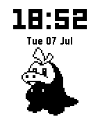
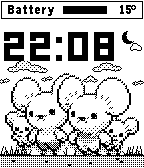

# Pokémon Pebble Watchfaces

Custom Pebble watchfaces built for a **Pebble 2 Duo** — Core Devices' 2025 relaunch of Pebble,
with a black & white e-paper screen. Everything builds and runs through Docker, so you don't
need to install the Pebble SDK on your host machine at all.

Two faces live here, sharing one toolchain:

| Folder | Face | Shows |
|---|---|---|
| `fuecoco-face/` | **Fuecoco**, the fire-crocodile | battery bar, time, a small procedural weather icon |
| `maushold-face/` | **Maushold**, the family of four | battery bar, time, **live temperature**, a 19-icon weather set, and a full pixel-art scene |

Pick which one you're working on with the `FACE` environment variable (see Dev workflow).
`FACE` defaults to `fuecoco-face`, so existing commands keep working unchanged.

This is a personal hobby project — it's not published to the Pebble App Store, so Pokémon
trademark concerns don't apply here.

| Fuecoco | Maushold |
|---|---|
|  |  |

## Hardware target

The Pebble SDK codename for this watch is **`flint`**, not `obelix` (an earlier version of this
scaffold used `obelix` by mistake — that's actually the *Pebble Time 2*, a different, pricier
watch with a 200×228 **color** screen). Verified directly against Core Devices' firmware source
(`display_qemu_flint.h` in `coredevices/PebbleOS`):

| | `flint` (Pebble 2 Duo — this repo's target) | `obelix` (Pebble Time 2) |
|---|---|---|
| Resolution | 144×168 | 200×228 |
| Color | Black & white only | 64-color |
| Price | $149 | $225 |

Because the screen is strictly 1-bit, all artwork in this project uses pure black/white pixels —
no grayscale, no color.

## Prerequisites

- **Docker**, with the daemon actually running. If you're on a snap-installed Docker (`which
  docker` → `/snap/bin/docker`), the systemd unit is `snap.docker.dockerd.service`, **not**
  `docker` — `sudo systemctl start docker` will silently do nothing on that setup. Check with
  `systemctl is-active snap.docker.dockerd.service`.
- **X11** on the host, for the emulator's GUI window (`./dev.sh emu`). On Linux this generally
  just works; `dev.sh` runs `xhost +local:` for you automatically.
- A physical Pebble 2 Duo + the Pebble mobile app, only if you want `./dev.sh install <ip>`
  (enable Developer Connection in the app's settings to get the watch's IP).

## Project structure

```
dev.sh                          # all dev commands go through this; FACE picks the watchface
docker-compose.yml              # single "pebble" service, mounts ${FACE}/ into the container
Dockerfile                      # Ubuntu 24.04 + pebble-tool + Pebble SDK ("latest")
fuecoco-face/
  package.json                  # app metadata: UUID, targetPlatforms: ["flint"], resources,
                                 #   enableMultiJS/capabilities/messageKeys for weather
  wscript                       # waf build script (multi-platform loop, standard pebble-tool pattern)
  src/c/fuecoco.c                # watchface source: battery module, time, weather icon, Fuecoco
  src/pkjs/index.js              # runs on the phone: fetches weather, relays it to the watch
  resources/images/
    fuecoco.png                  # 82x98, pure black/white, extracted from reference/fuecpix.png
  reference/
    fuecpix.png                   # source cross-stitch chart the sprite is extracted from (see Credits)
  scripts/
    generate_fuecoco_art.py      # regenerates fuecoco.png from reference/fuecpix.png (via Pillow)
    create_app_icons.py          # vendored from Core Devices' watchface skill (see Credits)
    create_preview_gif.py        # vendored from Core Devices' watchface skill (see Credits)
  .devcontainer/                 # optional: open this folder directly in VS Code Dev Containers
maushold-face/
  package.json                  # own UUID; 20 bitmap resources; 6 messageKeys for the weather payload
  src/c/maushold.c              # info bar (battery + temperature), time, weather icon, scene
  src/pkjs/index.js             # fetches 5 weather fields, caches last position, retries once
  resources/images/
    maushold_scene.png          # 144x107 baked scene: the family, sky, grass, ground
    wx/*.png                    # 19 hand-authored 26x26 weather icons
  reference/
    maushold.webp               # source cross-stitch chart (see Credits)
    weather_contact_sheet.png   # all 19 icons at 4x, for reviewing the set at a glance
  scripts/
    generate_maushold_art.py    # rebuilds maushold_scene.png from the chart
    generate_weather_icons.py   # rebuilds wx/*.png and the contact sheet
```

## Dev workflow

One-time setup:
```bash
docker compose build
```

**Choosing a face.** Every command below takes an optional `FACE` prefix; it defaults to
`fuecoco-face`.

```bash
./dev.sh build                      # builds fuecoco-face
FACE=maushold-face ./dev.sh build   # builds maushold-face
FACE=maushold-face ./dev.sh emu
```

Everyday commands (run from the repo root):

| Command | What it does |
|---|---|
| `./dev.sh build` | Compiles the watchface → `$FACE/build/*.pbw` |
| `./dev.sh emu` | Builds, installs to the `flint` QEMU emulator, opens a window on your desktop, and leaves the container running |
| `./dev.sh screenshot [file.png]` | Captures a PNG from the emulator started by `emu` (default `screenshot.png`) |
| `./dev.sh watch` | Live reload: rebuilds and reinstalls on any change under `src/` or `resources/` |
| `./dev.sh install <phone-ip>` | Builds and installs to a physical Pebble over WiFi |
| `./dev.sh icons` | Generates `icon_80x80.png`/`icon_144x144.png` from a screenshot |
| `./dev.sh gif` | Captures a rollover preview GIF from the running emulator |
| `./dev.sh shell` | Drops into a shell inside the build container |

**Seeing the watchface locally** is a two-terminal pattern: `./dev.sh emu` in one terminal (leave
it running), then `./dev.sh screenshot fuecoco.png` in a second terminal. The PNG lands in
`$FACE/` on your host, via the bind mount already set up in `docker-compose.yml` — open it
in any image viewer. Keep the same `FACE` value in both terminals: `screenshot` execs into the
container `emu` started, so a mismatch just screenshots the other face.

**Regenerating artwork** happens on the host, not in the container — these scripts need numpy,
which the image doesn't carry:

```bash
cd maushold-face
python3 scripts/generate_maushold_art.py     # -> resources/images/maushold_scene.png
python3 scripts/generate_weather_icons.py    # -> resources/images/wx/*.png + contact sheet
```

## Getting it onto your actual watch

Building produces `fuecoco-face/build/<name>.pbw` — that single file *is* the installable
watchface. There are two ways to get it from there onto your Pebble 2 Duo:

### Option A — WiFi install via Developer Connection (fastest while iterating)

This is what `./dev.sh install <phone-ip>` (and `./dev.sh watch`) use. It pushes straight from
this repo to your watch over your phone's Bluetooth connection, no cables or file transfer
needed — but your computer and phone must be on the same WiFi network, and it needs to be
re-enabled each time you restart the Pebble app.

1. Open the Pebble app on your phone.
   - **Android**: tap the ⋮ overflow menu (top right) → *Settings* → enable *Developer Mode* →
     tap *Developer Connection* → toggle it on (top right).
   - **iOS**: open the side menu → *Settings* → enable *Developer Mode* → go back and tap
     *Developer* → toggle *Developer Connection* on (top right).
2. Either app then displays a **Server IP** — that's the `<phone-ip>` argument.
3. Run `./dev.sh install <phone-ip>` from this repo. It rebuilds and pushes the `.pbw` straight
   to the watch.

### Option B — Sideload the .pbw permanently (no computer needed afterward)

Better for "I just want to actually wear this," since it doesn't depend on developer mode staying
on or being near your computer. Get the `.pbw` file onto your phone (AirDrop, email yourself the
file, a cloud drive/USB — anything that lands it in your phone's normal file storage), then:

- **Android**: open it from your file manager; it should offer to open with the Pebble app,
  which installs it to the watch. If your file manager doesn't recognize the `.pbw` (common on
  newer Android versions), install [Sideload Helper by
  Rebble](https://github.com/pebble-dev/rebble-sideloader) and open the file with that instead —
  it hands it off to the Pebble app for you.
- **iOS**: use the Share Sheet on the `.pbw` (from Files, Mail, AirDrop, etc.) and choose
  *Open in Pebble* / *Copy to Pebble*, which installs it to the watch.

Either way, once installed it shows up in the watch's app/watchface list like anything from the
App Store — no ongoing WiFi/developer-mode dependency.

## Fuecoco design notes

The character art is **extracted from a real fan-made pixel/cross-stitch chart**
(`reference/fuecpix.png`, 41×49 stitches — see Credits) rather than hand-drawn from scratch, so
proportions and features (the head-flame, cream face, red back marking, tail) match the actual
character instead of an approximation. `scripts/generate_fuecoco_art.py` does the conversion:

1. Samples each stitch cell's colour from the chart (avoiding the grid lines), rebuilding a clean
   41×49 mosaic.
2. Whites out the DMC colour-key/legend panel in the chart's top-right corner — that panel is
   chart metadata, not part of the character, and must not leak into the silhouette.
3. Thresholds by luminance into pure black/white: darker threads (outline, the red back marking,
   the flame crest) become black; lighter threads (cream face/belly) become white. The 1-bit
   `flint` display can't show the original DMC colours anyway, so this keeps the two most
   important shapes — the back marking and the flame crest — bold and recognisable instead of
   losing them to a mid-tone gray.
4. Scales the result 2x with nearest-neighbour (no smoothing) to 82×98 for a crisp pixel-art look.

Time stays a plain `TextLayer` with a system font, positioned **above** the character so it never
overlaps or crowds the art.

Layout (checked so every element's bottom/right edge stays inside the 144×168 bounds):

| Element | `GRect` | Notes |
|---|---|---|
| Battery module | `GRect(1, 1, 142, 18)` | bordered box: "Battery" label (bold, left) + depletion bar (right) |
| Time | `GRect(0, 19, 144, 42)` | `FONT_KEY_LECO_42_NUMBERS`, centered |
| Weather icon | `GRect(115, 78, 21, 21)` | small, clear of Fuecoco's full `GRect` (x≥113) — see below |
| Fuecoco | `GRect(31, 68, 82, 98)` | centered horizontally, 2px margin above the bottom edge |

To change the artwork: either replace `resources/images/fuecoco.png` with your own pure
black/white PNG at 82×98 (`BitmapLayer` doesn't scale), or tweak `THRESHOLD`/`SCALE` in
`scripts/generate_fuecoco_art.py` and re-run it (`python3 scripts/generate_fuecoco_art.py` from
inside `fuecoco-face/`) to regenerate from the reference chart with different tuning.

## Maushold design notes

Same extraction technique as Fuecoco — `reference/maushold.webp` is a cross-stitch chart
(67×40 stitches, see Credits) sampled cell-by-cell and ordered-dithered to 1-bit — but two
things about this chart forced changes, and the result gets a whole scene rather than a bare
sprite.

**Three mask regions, not one.** Fuecoco's script whites out a single top-right rectangle for
the DMC colour key. This chart has *three* separate furniture blocks — the title box, the
colour key and the "Aida Dimensions" box — plus a black frame band down the right edge. A
single blanket mask over the top-right would quietly amputate the fourth, smallest Maushold,
which sits at roughly cols 58–67 / rows 23–31, right underneath where that mask would land.

**The silhouette comes from the stitch mosaic, not the dithered pixels.** To let grass and sky
show *around* the family, the scene needs a cutout mask. Flood-filling white inward from the
border is the obvious way to get one, and it fails badly here: the mice's grey fur is a ~50%
Bayer texture whose white pixels form a connected path from the outside straight into their
heads, so the fill swallows the characters and the background texture shows through their
faces. At stitch resolution there's no ambiguity — a cell is either charted or it's blank
paper — so the mask is built there and upscaled.

At `SCALE = 2` the family is **134×80 px**, nearly the full 144px screen width (Fuecoco is only
82 wide). That single fact drives the layout: there is no gap beside the character for a
weather icon — the largest empty rectangle anywhere inside its footprint is 8×44 px — so the
icon moved up next to the time instead.

**The scene** (`generate_maushold_art.py`, stage B) is composed back-to-front in Python and
baked into one 144×107 bitmap, so the watch just blits it:

1. Six clouds of four different sizes, placed into the sky pockets the family actually leaves
   open — the full-width band above y12, the two gaps between the big heads, and the left and
   right margins. A build-time assertion fails if any cloud touches the family.
2. A contact shadow that hugs the silhouette's bottom contour column by column. Dropping one
   ellipse per foot was the first attempt: neighbouring mice merge into a single 52px-wide
   blob, and a run whose lowest pixel is a belly rather than a foot leaves a shadow hanging in
   mid-air. Shading directly beneath whatever ink is lowest in each column can't float, and it
   traces all four bodies for free. It's graded — 50% on the contact row, 25% below — because a
   flat 50% turns to mud where it meets the mice's own dithered legs.
3. The family, pasted through its cutout mask.
4. Grass tufts and small flowers drawn **in front of** the feet, denser at the left and right
   edges to frame the scene and sparse in the middle so the legs stay readable.
5. A ground line that wobbles by a pixel so it doesn't read as a ruler, over a soil band of
   25% lattice with a few pebbles.

Two rules keep it from turning to mush. Background greys use **regular lattices**
(12.5%/25%/50%), never Bayer — sharing the character's dither pattern makes the two moiré
against each other. And there's an **ink budget**: the script asserts that non-character art
covers no more than 22% of the scene (it currently sits at 8.3%). An earlier version had
rolling dithered hills behind the family; because the mice cover half the scene, the hills
were invisible except as a hard horizontal band across the margins, and they were cut.

Layout (checked so every element's bottom/right edge stays inside the 144×168 bounds):

| Element | `GRect` | Notes |
|---|---|---|
| Info bar | `GRect(1, 1, 142, 18)` | bordered box: "Battery" label + bar + temperature, right-aligned |
| Time | `GRect(0, 19, 112, 42)` | `FONT_KEY_LECO_42_NUMBERS`, centred within 112px, not the full width |
| Weather icon | `GRect(114, 26, 26, 26)` | right of the time, directly below the temperature |
| Scene | `GRect(0, 61, 144, 107)` | the baked bitmap above |

The scene layer is added to the window **first**, so everything else composites on top of it.
Fuecoco adds its character bitmap last, which means the opaque white of `GCompOpAssign` paints
over anything sharing its `GRect` — that's why Fuecoco's weather icon is pinned to `x≥113`.
Ordering the layers correctly removes that constraint entirely.

## Weather

A small icon shows current conditions, updated from real weather data at the phone's
GPS location. Both faces share the data source and the watch↔phone plumbing; they differ in how
much of the reading they ask for and what they do with it.

**Data source: [Open-Meteo](https://open-meteo.com/)** — free, no API key required. There's no
public, no-auth "Google Weather" API usable for this; Open-Meteo is what the wider Pebble
developer ecosystem (including Core Devices' own official tooling, see Credits) uses for exactly
this purpose, so it's the de facto standard for Pebble weather watchfaces.

**How it flows** (the watch itself has no internet access — only the paired phone does):
```
Watch (the .c file)  <-- AppMessage / Bluetooth -->  Phone (src/pkjs/index.js)  <-- HTTPS -->  Open-Meteo
```

### Fuecoco's weather model

1. `src/pkjs/index.js` runs on the phone (not the watch). On watchface launch, and every 30
   minutes after (triggered by the watch via a `REQUEST_WEATHER` message from `tick_handler`), it
   calls `navigator.geolocation.getCurrentPosition()` for the phone's GPS location, fetches
   `current=weather_code` from Open-Meteo for those coordinates, and sends the resulting WMO
   weather code to the watch as `WEATHER_CODE`.
2. The watch's `inbox_received_callback` in `fuecoco.c` receives it, maps the WMO code to one of
   five categories via `weather_code_to_condition()` (clear / cloudy / rain / snow / storm), and
   redraws the icon: sun, cloud, rain (cloud + drops), snow (cloud + dots), or storm (cloud +
   lightning bolt). Nothing is drawn until the first reading arrives.

This requires `enableMultiJS`, `"capabilities": ["location"]`, and `"messageKeys"` in
`package.json` — already set up. The **first time** the watchface runs on a real phone, the
Pebble app will prompt for location permission; without it, the icon just stays blank (no crash,
no fallback text, since we chose to keep this minimal rather than add error-state UI).

To add more conditions or change the icon shapes, edit `weather_code_to_condition()` and
`weather_icon_update_proc()` in `fuecoco.c` — the WMO code table is documented inline and at
[Open-Meteo's docs](https://open-meteo.com/en/docs) under "WMO Weather interpretation codes".

### Maushold's weather model

Fuecoco's five procedural shapes are drawn with `graphics_fill_rect`/`graphics_draw_line` in an
update_proc. On a 1-bit panel that gives a rounded pill for "cloud" and three diagonal
scratches for everything wet, so rain, drizzle, sleet and showers are indistinguishable.
Maushold replaces the lot with **19 hand-authored 26×26 sprites** (`resources/images/wx/`,
~4KB total against a 1MB budget), generated by `scripts/generate_weather_icons.py` and
reviewable as a single contact sheet at `reference/weather_contact_sheet.png`.

The set is designed as a *vocabulary*, which is what makes it readable:

- **Sun and moon are the only solid black shapes**, so "is it clear?" is answerable without
  reading any detail.
- **Clouds are 1px outlines with white interiors**, so whatever sits under them — drops,
  flakes, a bolt — stays legible instead of fighting a black mass. The one exception is
  overcast, which is a single *hatched* cloud: two overlapping outlined clouds was the first
  attempt and at 26px the shared outline just fuses them into one lumpy mass, whereas the only
  filled cloud in the set unmistakably means "socked in".
- **Sky cover is encoded by cloud quantity**: sun alone → sun + small corner cloud → sun behind
  a big cloud → hatched cloud, no sun.
- **Precipitation type** is carried by the accent glyph below the cloud, **intensity** by how
  many of them there are (3 streaks for rain, 5 denser ones for heavy rain).

The phone now sends five fields instead of one, because the WMO code alone can't answer the
questions the icons need:

| Field | Why |
|---|---|
| `weather_code` | the condition, as before |
| `temperature_2m` | rounded to a whole degree for the info bar — the face had no temperature at all before |
| `is_day` | picks the sun or moon variant of every clear/cloudy icon. Codes 0–2 say nothing about whether the sun is up, so a single "clear" icon is wrong half the time |
| `cloud_cover` | grades codes 0–3, which are a blunt instrument — a 40%-covered sky and a 95%-covered one can both arrive as code 3. Since codes 0–3 are what's showing most days here, this is where most of the added nuance actually comes from |
| `wind_speed_10m` | promotes an otherwise-unremarkable sky to the windy icon at ≥38 km/h (Beaufort 6) |

The JS side also caches the last known GPS position in `localStorage` and falls back to it when
a fix fails (which it will, indoors or with the screen locked), and retries a failed fetch once
after a minute. `WX_NODATA` and `--°` show only before the first-ever successful reading; after
that a transient failure leaves the last good values on screen rather than blanking the face.

Only the current icon is ever resident in memory — `weather_icon_update_proc` destroys the
previous `GBitmap` and loads the new one when the condition changes.

## Roadmap (not yet built)

Two variants are planned but intentionally not implemented yet:

- **Time-of-day variant** — swap Fuecoco's pose/expression or the background by hour bucket.
  Cheap to add: the existing `tick_handler` already fires every minute with the current
  `struct tm`, so bucketing on `tick_time->tm_hour` is close to free.
- **Animated variant** — an idle animation (blink, tail-flame flicker). Follow the
  "brief `app_timer_register()` bursts, never continuous per-second redraws" rule from Core
  Devices' watchface skill (see Credits) — a battery-efficiency requirement, not a style choice.
  Since the character is now a single bitmap rather than separate body/flame layers, this would
  need a small set of alternate full-frame bitmaps (or a cropped sub-region swapped independently)
  rather than reusing the current single-layer setup as-is.

## Creating a new watchface from this repo

1. Copy `fuecoco-face/` (or `maushold-face/`) to `<your-name>-face/` alongside it. No
   `docker-compose.yml` change is needed — the mount is `./${FACE:-fuecoco-face}:/workspace`,
   so `FACE=<your-name>-face ./dev.sh build` picks it up.
2. Generate a new UUID: `python3 -c "import uuid; print(uuid.uuid4())"`.
3. Edit `package.json`: `name`, `displayName`, `uuid`, and the `resources.media` list for your
   new art files.
4. Replace `src/c/fuecoco.c` with your new watchface logic (or start from
   `templates/static-watchface.c` in Core Devices' skill repo, see Credits).
5. Replace the artwork in `resources/images/`.
6. Clear the stale build cache: `rm -rf <your-name>-face/build` (it's root-owned, from the
   Docker build — see Troubleshooting).
7. Verify with the workflow above: `FACE=<your-name>-face ./dev.sh build`, then `emu` +
   `screenshot`.
8. Update this README for the new project.

## Troubleshooting

- **`docker ps`/`sudo systemctl start docker` seem to show nothing running** — on a snap install,
  check `snap.docker.dockerd.service`, not `docker`.
- **X11 "cannot open display"** — confirm `$DISPLAY` is set and run `xhost +local:` (dev.sh
  does this automatically via its `xsetup` step, but it's a no-op, not an error, if X11 access is
  already granted).
- **Stale `build/` cache after changing target platforms** — `fuecoco-face/build/` is written as
  root inside the container. If you need to delete it and get a permission error, remove it via a
  throwaway container instead of `sudo`: `docker run --rm -v "$(pwd)/fuecoco-face:/workspace"
  alpine sh -c "rm -rf /workspace/build"`.
- **`./dev.sh screenshot` fails with "no such service/container"** — make sure `./dev.sh emu` is
  still running in another terminal; `screenshot` execs into that same container and doesn't
  start its own.
- **Running these commands from an AI coding agent / sandboxed shell** — some sandboxes kill
  container processes that stream output live over an attached terminal, even though the same
  command works fine interactively. If `pebble build`/`install`/`screenshot` fail silently with no
  output in that kind of environment, redirect to a file inside the mounted volume instead (e.g.
  `pebble build > /workspace/build.log 2>&1`) and read the log back from the host afterward —
  that sidesteps the issue entirely. Not a concern for normal terminal use.

## Credits

- The Fuecoco sprite in `resources/images/fuecoco.png` is extracted from a fan-made cross-stitch
  chart (`reference/fuecpix.png`) designed by Smogon user **KingOfThe-X-Roads**. Pokémon © Nintendo.
- The Maushold sprite in `resources/images/maushold_scene.png` is extracted from a fan-made
  cross-stitch chart (`reference/maushold.webp`) of a fan sprite designed by Smogon user
  **Travis**; chart by **jack_of_all_threads** / r/jackofallthreads. Pokémon © Nintendo.
- Reference templates, drawing guides, and the `create_app_icons.py`/`create_preview_gif.py`
  scripts (adapted for the `flint` platform) come from Core Devices' own
  [`pebble-watchface-agent-skill`](https://github.com/coredevices/pebble-watchface-agent-skill).
